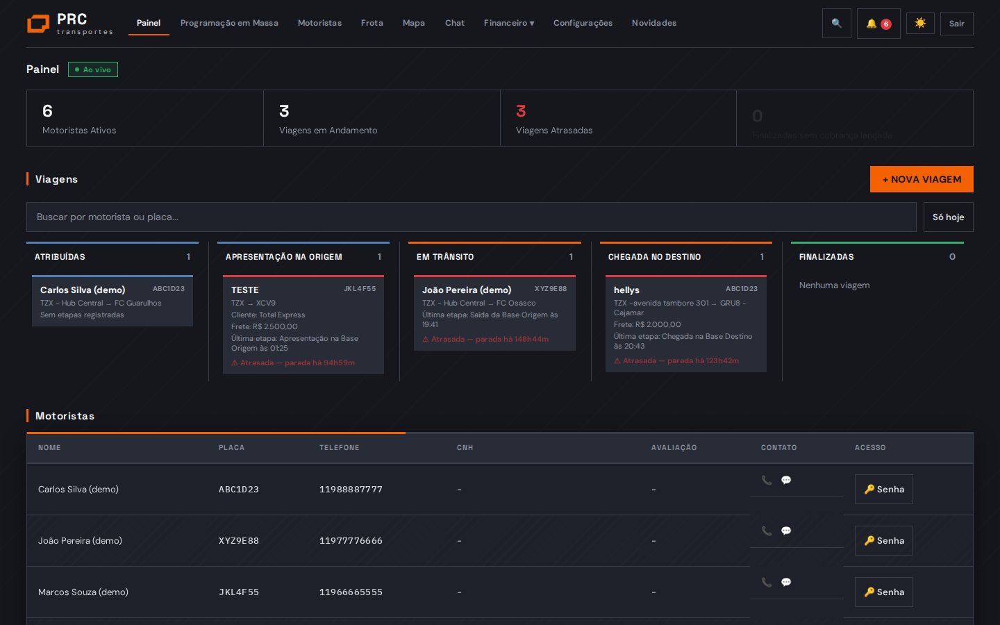
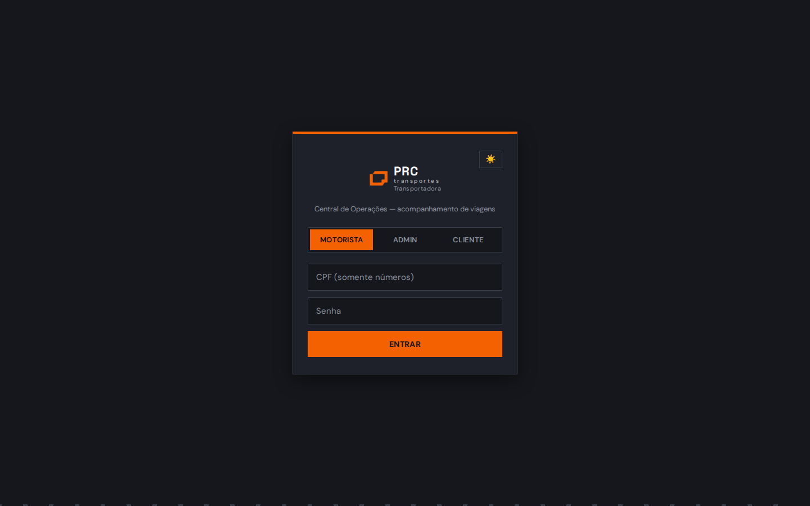
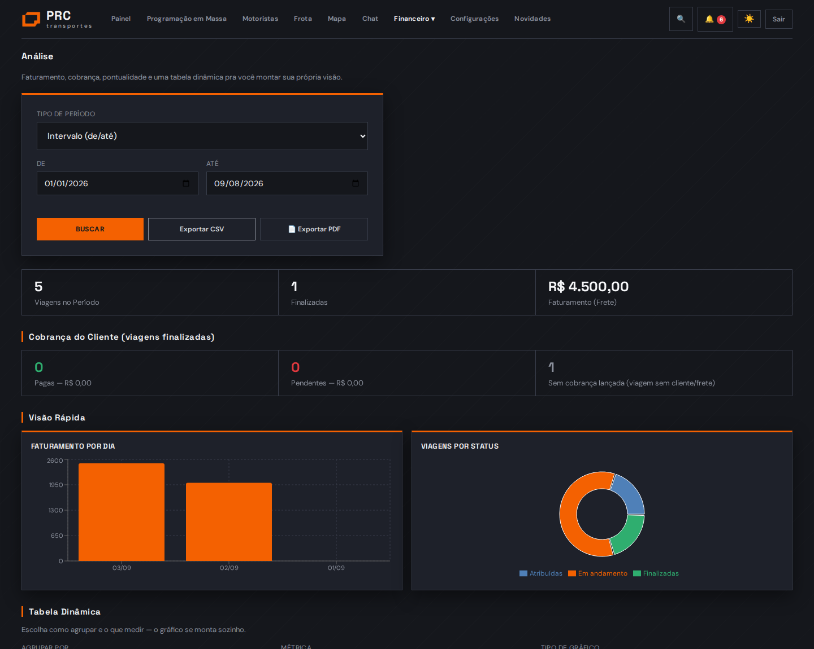
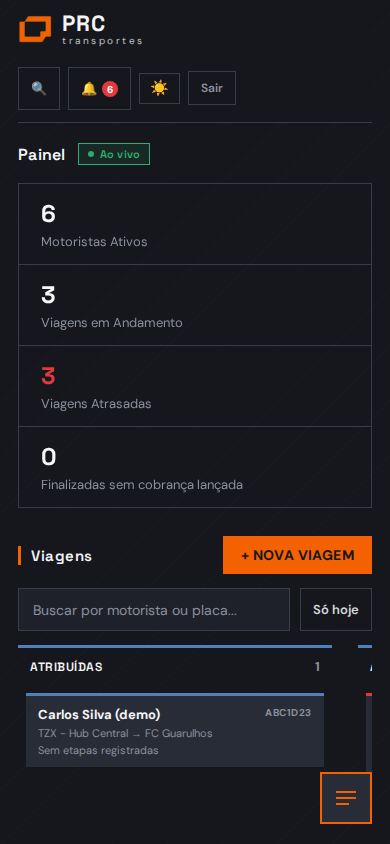

<div align="center">



# 🚚 PRC App
### Sistema de Gestão de Transportes

Kanban de viagens em tempo real · foto geolocalizada · financeiro automático · portal do cliente

[](https://react.dev)
[](https://vitejs.dev)
[](https://supabase.com)
[](#)
[](https://pages.cloudflare.com)

</div>

---

## 📋 Sumário

- [Como rodar localmente](#-como-rodar-localmente)
- [Como publicar](#-como-publicar-cloudflare-pages-gratuito)
- [Login — três tipos de acesso](#-login--três-tipos-de-acesso)
- [Funcionalidades](#-funcionalidades)
- [Telas](#-telas)
- [Perfis de acesso](#-perfis-de-acesso-administrativo)
- [Tecnologia](#-tecnologia)
- [Pendências conhecidas](#-pendências-conhecidas)

---

## 🚀 Como rodar localmente

```bash
npm install
npm run dev
```

Abre em `http://localhost:5173`.

## ☁️ Como publicar (Cloudflare Pages, gratuito)

<details>
<summary><b>Opção A — Direto pelo GitHub (recomendado)</b></summary>

<br>

1. Crie um repositório novo no GitHub (pode ser privado)
2. Suba esta pasta inteira para o repositório:
   ```bash
   git init
   git add .
   git commit -m "Atualização do app"
   git branch -M main
   git remote add origin https://github.com/SEU-USUARIO/prc-app.git
   git push -u origin main
   ```
3. Acesse [dash.cloudflare.com](https://dash.cloudflare.com) → **Workers & Pages** → **Create** → **Pages** → **Connect to Git**
4. Selecione o repositório
5. Configuração de build:
   - **Framework preset**: Vite
   - **Build command**: `npm run build`
   - **Build output directory**: `dist`
6. **Save and Deploy** — a cada `git push`, o Cloudflare já republica sozinho

</details>

<details>
<summary><b>Opção B — Upload direto (sem GitHub)</b></summary>

<br>

1. `npm install && npm run build`
2. Isso gera a pasta `dist/`
3. No Cloudflare Pages, escolha **"Upload assets"**
4. Arraste a pasta `dist/` inteira

</details>

---

## 🔑 Login — três tipos de acesso

<div align="center">

</div>

| Quem | Como loga |
|---|---|
| 🧑‍✈️ **Motorista** | CPF (só números) + senha |
| 🖥️ **Admin** | Email + senha |
| 🌐 **Cliente** | Email + senha (login gerado pelo admin em Configurações → Clientes) |

O primeiro administrador foi cadastrado direto no banco durante o desenvolvimento. Outros admins são criados dentro do próprio app, em **Configurações → Logins** (só "Diretoria" vê essa opção).

---

## ✨ Funcionalidades

### 📊 Painel (Admin)
- Kanban por etapa da viagem, atualizando em tempo real
- Alerta automático de viagem atrasada (+2h sem nova etapa)
- Planejado x real de cada etapa, barra de progresso (X/4), progresso de paradas de entrega
- Busca global (motorista, cliente, viagem) em qualquer tela
- Central de notificações: CNH vencendo, viagem parada, cobrança pendente
- Botão de ajuda contextual (❓) explicando cada tela
- **Modo TV** — painel de parede sem menu: números grandes + mapa ao vivo + lista de viagens

<details>
<summary><b>🚚 Operação</b></summary>
<br>

- Criação de viagem individual ou em massa (várias de uma vez, por rota)
- **Múltiplas paradas de entrega** — uma viagem pode ter vários destinos em sequência, cada um com foto de comprovação
- **Programação recorrente** — cadastra "toda segunda, rota X" uma vez, gera as viagens da semana com um clique
- Observação interna (só admin vê, nunca aparece pro cliente)
- Duplicar rota (copia valores, só troca código)
- Distância e tempo de viagem calculados de verdade (roteirização via malha rodoviária)

</details>

<details>
<summary><b>📱 App do Motorista (PWA)</b></summary>
<br>

- Login por CPF
- Foto obrigatória por etapa, com carimbo automático (nome, placa, endereço, data/hora)
- Tirar foto na hora ou escolher da galeria
- Rastreamento GPS com fila offline (funciona sem sinal, sincroniza depois)
- Checklist de saída do veículo
- Reportar ocorrência/avaria com foto (fica pendente até o admin aprovar)
- Assinatura digital do cliente na tela, no fim da descarga
- Chat direto com a central, com fila offline
- Desfazer última etapa registrada por engano
- Baixar os próprios dados (LGPD)

</details>

<details>
<summary><b>💰 Financeiro</b></summary>
<br>

- Conta a receber (cliente) e a pagar (motorista) geradas automaticamente por viagem
- Preço de frete e pagamento por rota, não precisa digitar toda vez
- Aviso automático de viagem finalizada sem cobrança lançada
- **Folha de Pagamento** — soma por motorista no período, lança desconto/bônus, gera recibo em PDF
- Estrutura pronta pra emissão de NFe (precisa contratar provedor pra ativar)

</details>

<details>
<summary><b>📈 Análise</b></summary>
<br>

- Filtro de período flexível: intervalo, semana(s) ISO, dias avulsos, ano inteiro
- Gráficos de faturamento, status e pontualidade planejado x real
- Tabela dinâmica: escolhe dimensão + métrica + tipo de gráfico
- Ranking de pontualidade por motorista
- Exportar em CSV e PDF

</details>

<details>
<summary><b>🔧 Frota &nbsp;·&nbsp; 👥 Motoristas &nbsp;·&nbsp; 🌐 Portal do Cliente</b></summary>
<br>

**Frota**
- Cadastro de veículo (toco, 3/4, VUC, carreta com 2 placas)
- Manutenção: km, tipo de serviço, aviso de próxima revisão
- Alerta de CRLV vencendo

**Motoristas**
- CPF validado de verdade (dígito verificador)
- CNH com alerta de vencimento
- Avaliação pelo cliente (1-5 estrelas), média visível pro admin
- Contato rápido (ligar/WhatsApp)

**Portal do Cliente**
- Login próprio — só vê as próprias viagens
- Acompanha status e foto de cada etapa, vê documentos anexados
- Avalia o motorista depois da entrega
- Baixa os próprios dados (LGPD)

</details>

<details>
<summary><b>🔒 Segurança</b></summary>
<br>

- **Row Level Security** no banco — cada perfil só acessa o próprio dado, garantido no servidor
- Motorista não consegue ter 2 viagens abertas ao mesmo tempo (trava no banco)
- Motorista só altera o status da própria viagem, mais nada
- Log de auditoria de exclusões (quem, quando, o quê)
- Senha mínima de 8 caracteres · redefinição restrita à Diretoria
- **2FA** por QR code, em "Minha Segurança"
- 6 perfis administrativos com permissão customizável por usuário

</details>

---

## 🖼️ Telas

<div align="center">
<table>
<tr>
<td align="center" width="50%"><br><sub><b>Análise</b> — gráficos e tabela dinâmica</sub></td>
<td align="center" width="50%"><br><sub><b>Mobile</b> — responsivo de verdade</sub></td>
</tr>
</table>
</div>

---

## 👤 Perfis de acesso administrativo

| Cargo | Acesso |
|---|---|
| **Diretoria** | Tudo |
| **Operacional** | Painel, Nova Viagem, Motoristas, Frota |
| **Financeiro** | Painel, Financeiro, Folha de Pagamento, Análise |
| **Torre de Controle** | Painel, Mapa, Chat |
| **Captação** | Painel, Motoristas |
| **Manutenção** | Painel, Frota |

Cada usuário pode ter permissão customizada, sobrescrevendo o padrão do cargo (Configurações → Logins).

---

## 🛠️ Tecnologia

| Camada | Ferramenta |
|---|---|
| Frontend | React + Vite, PWA |
| Backend | Supabase (PostgreSQL, RLS, Realtime, Auth, Storage, Edge Functions) |
| Gráficos | Recharts |
| PDF | jsPDF |
| Mapas | Leaflet + OpenStreetMap |
| Roteirização | OSRM (demo pública, gratuita) |
| Deploy | Cloudflare Pages |

## ⚠️ Pendências conhecidas

> Dependem de contratar um serviço externo pago — não fazem parte do app em si.

- **Emissão de NFe** — campo pronto no banco, precisa de provedor com certificado digital (Focus NFe, eNotas, NFe.io)
- **WhatsApp/SMS automático** — hoje o envio é manual (link do WhatsApp); automatizar precisa de conta business paga (Twilio, WhatsApp Business API)
- **Roteirização em produção pesada** — usa o servidor de demonstração gratuito do OSRM, sem SLA; se o uso crescer muito, vale migrar pra um serviço pago

<div align="center">
<sub>Feito com 🧡 pra rodar de verdade, não só de mentirinha.</sub>
</div>
